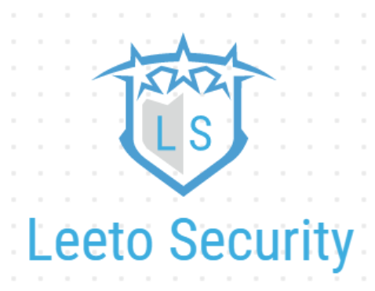

<h1 align= "center">Leeto Security</h1>

  

  Leeto Security is a JavaFX Application designed for the elderly to help store and create secure passwords, protecting them from cybersecurity threats using advanced hashing algorithms.

## Project Synopsis
Many elderly people or people that were born in an earlier generation have not been exposed to technology and the internet in the early stages of their lives. They have limited knowledge the significance of internet security in the current day. For example, research has shown that seniors hold many characteristics that make them vulnerable to being hacked online. These characteristics include their lack of knowledge when it comes to the internet and computer skills. Many seniors, for example, are primary targets for scams. Seniors tend to be more worried and concerned about technology-related issues. As a result, when scams are sent out to seniors that state that there is some type of issue, seniors are likely to fall for it since they are more trusting and have less knowledge about internet safety. Many hackers and scammers use password-extraction software in the malware that they send out to seniors. The sense of internet security that seniors have is also weaker as they do not have much awareness of the significance of internet security. Research has also shown that many computers that seniors use are not properly secured and equipped with security software. All of these factors make seniors susceptible to being hacked. 
 
Therefore, it becomes more and more important and aware about cybersecurity for seniors.  
This project aims to protect them by providing a non-complicated app that can easily create password hashes for the elderly to use, while storing them so that they do not have to be tasked with remembering passwords.

## How it Works
- During the creation of a password, the user has to type in an Organization name (what website/app they will use this particular password for).
  - This name gets assigned a randomly generated key or a typed key of the user's choice, and this key is the item that gets hashed. The result of hashing the key gives the hashed password, which is the password that the user will use.
  - The hashing algorithms use SHA-256 Hashing to create a password that has extremely high password entropy (measure of password strength).
    - Therefore, the password in itself is impossible to crack, and the key is impossible to find as well since hashing algorithms are irreversible.
  - Password data is then stored in .dat files which are ineligible, and hard to gain access to.
 

- Recommendations to improve passwords is an additional feature as well.

## Report
You may read the rest of the report here:
[Report PDF](./Chem CPT Report - Kaden S, Christopher L.pdf)

#### This project was done in collaboration with Christopher Lee (@thewhitelisted)
 

